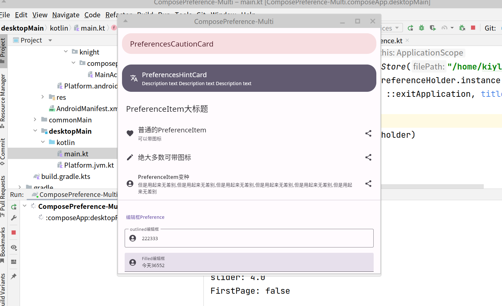
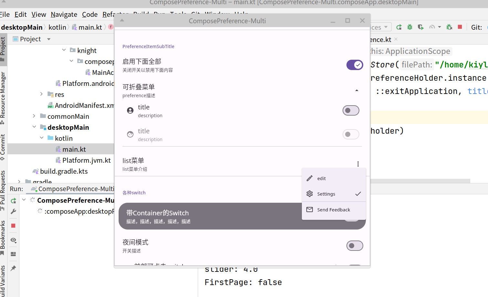
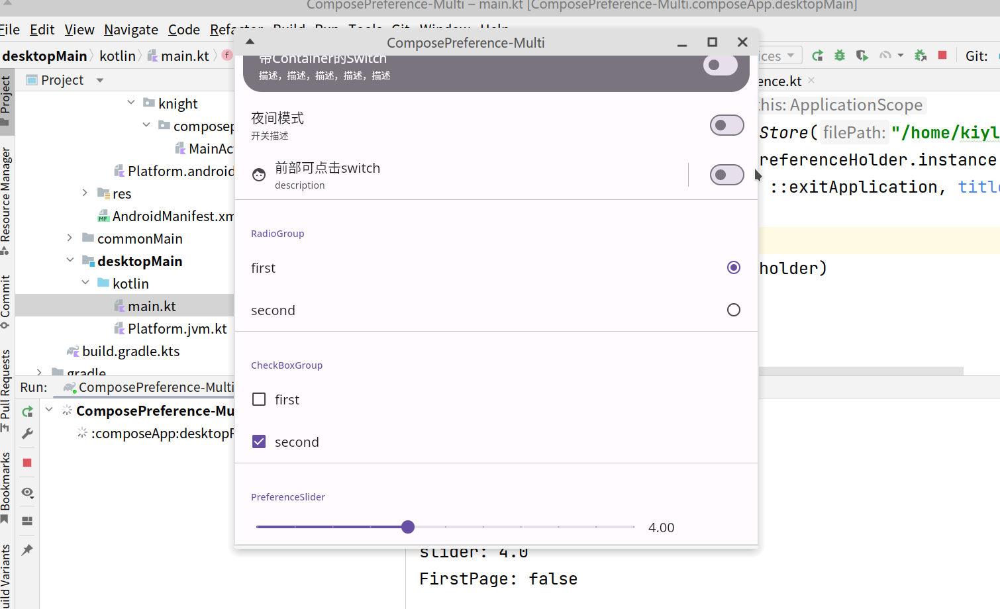
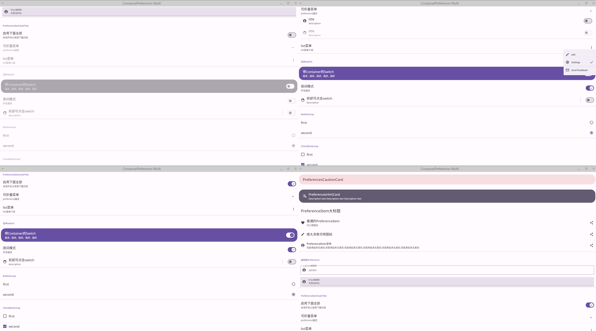
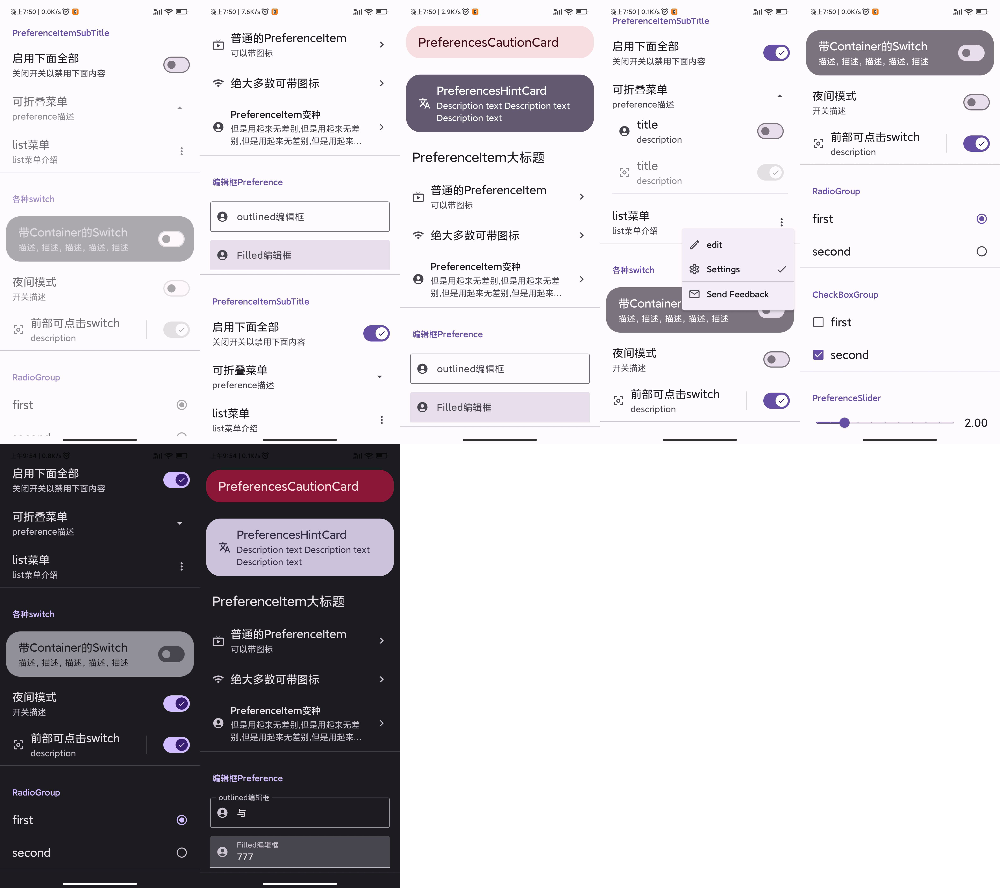

# 前言

本库是跨平台库，可以运行在android,linux,window等平台。

理论上也支持mac，ios等平台，但我没有mac，ios等设备，因此没有为其构建并测试打包。

# 图片

|              |
| -------------------------------------------- |
|              |
|              |
|  |
|  |


# 若是仅在android平台使用

由于本库是跨平台库，因此，相关依赖会与`android版本`有所差别，并内置了datastore读写实现。
因此若是仅为android平台构建应用，也可以使用

[android版本](https://github.com/Knightwood/ComposePreference) 专为android平台维护，支持datastore,sharedpreference,mmkv等。

# 若希望构建一个跨平台应用

## 版本 [](https://jitpack.io/#Knightwood/ComposePreferenceMultiplatform)

```
implementation("com.github.Knightwood.ComposePreferenceMultiplatform:preference-ui-compose-multi-android:1.0.0")
implementation("com.github.Knightwood.ComposePreferenceMultiplatform:preference-ui-compose-multi-desktop:1.0.0")
implementation("com.github.Knightwood.ComposePreferenceMultiplatform:preference-ui-compose-multi:1.0.0")

```

## 运行示例应用：

### 运行desktop

首先点击run/debug configurations

步骤：

1. 点击添加，选择gradle，在run的输入框中写入`desktopRun -DmainClass=MainKt --quiet`

2. gradle project 选择 ComposePreference-Multi:composeApp

### 运行android app

直接在run/debug configurations下拉框中选择composeApp,点击run

## 使用：

本库与[android版](https://github.com/Knightwood/ComposePreference)使用同一个读写接口，因此，在使用跨平台android依赖时，也可以依赖[android版](https://github.com/Knightwood/ComposePreference)中的mmkv和sharedpreference读写工具。


1. 手动生成DataStore文件，获取DataStorePreferenceHolder

```
//android
val dataStore = getDataStore(applicationContext,"ee.preferences_pb")
//desktop
val dataStore = getDataStore("/home/kiylxf/桌面/新建文件夹/ee.preferences_pb")
//获取holder
val holder = DataStorePreferenceHolder.instance(dataStore)
```


2. 构建preference页面
构建preference页面等功能与[android版](https://github.com/Knightwood/ComposePreference) 相同
```
PreferencesScope(holder = holder) {
        val customNodeName = "customNode"
        //创建一个自定义节点
        val node = holder.registerDependence(customNodeName, true)
        PreferencesCautionCard(title = "PreferencesCautionCard")
        PreferencesHintCard(title = "PreferencesHintCard")

        PreferenceItemLargeTitle(title = "PreferenceItem大标题")
        PreferenceItem(
            title = "普通的PreferenceItem",
            description = "可以带图标",
            icon = Icons.Filled.Favorite,
            endIcon = Icons.Filled.Share
        )
        PreferenceItem(
            title = "绝大多数可带图标",
            icon = Icons.Filled.Edit,
            endIcon = Icons.Filled.Share
        )

        PreferenceItemVariant(
            title = "PreferenceItem变种",
            icon = Icons.Filled.AccountCircle,
            endIcon = Icons.Filled.Share,
            description = "但是用起来无差别,但是用起来无差别,但是用起来无差别,但是用起来无差别,但是用起来无差别,但是用起来无差别"
        )

        HorizontalDivider()
        PreferenceItemSubTitle(title = "编辑框Preference")
        OutlinedEditTextPreference(
            title = "outlined编辑框", keyName = "edit11",
            defaultValue = "默认文本",
            icon = Icons.Filled.AccountCircle,
        )

        FilledEditTextPreference(
            defaultValue = "默认文本",
            title = "Filled编辑框",
            keyName = "edit12",
            icon = Icons.Filled.AccountCircle,
            changed = {

            }
        )
        HorizontalDivider()


        PreferenceItemSubTitle(title = "PreferenceItemSubTitle")
        PreferenceSwitch(
            keyName = "bol2",
            title = "启用下面全部",
            dependenceKey = DependenceNode.rootName,//指定依赖为根结点，这样自身就不会受到影响
            description = "关闭开关以禁用下面内容",
        ) {
            node.enableStateFlow.tryEmit(it)
        }
        PreferenceCollapseBox(
            title = "可折叠菜单",
            description = "preference描述",
            dependenceKey = customNodeName,
        ) {

            PreferenceSwitch(
                keyName = "bol",
                title = "title",
                dependenceKey = DependenceNode.rootName,//指定依赖为根结点，这样自身就不会受到影响
                description = "description",
                icon = Icons.Filled.AccountCircle
            ) { state ->
                //这里获取并修改了当前的enable状态，
                //依赖这个节点的会改变显示状态，
                //如果当前没有指定依赖，自身也会受到影响
                holder.getDependence("bol")?.let {
                    it.enableStateFlow.tryEmit(state)
                }
            }
            //依赖keyName为bol的PreferenceSwitch的state
            PreferenceSwitch(
                keyName = "bol3",
                title = "title",
                dependenceKey = "bol",
                description = "description",
                icon = Icons.Filled.Face
            )

        }

        PreferenceListMenu(
            title = "list菜单",
            keyName = "PreferenceListMenu",
            description = "list菜单介绍",
            dependenceKey = customNodeName,
            list = listOf(
                MenuEntity(
                    leadingIcon = Icons.Outlined.Edit,
                    text = "edit",
                    labelKey = 0
                ),
                MenuEntity(
                    leadingIcon = Icons.Outlined.Settings,
                    text = "Settings",
                    labelKey = 1
                ),
                MenuDivider,
                MenuEntity(
                    leadingIcon = Icons.Outlined.Email,
                    text = "Send Feedback",
                    labelKey = 2
                ),
            )
        ) {
            println( "menu item labelKey: $it")
        }
        HorizontalDivider()

        PreferenceItemSubTitle(
            title = "各种switch",
            dependenceKey = customNodeName,
        )
        PreferenceSwitchWithContainer(
            keyName = "bol4",
            title = "带Container的Switch",
            description = "描述，描述，描述，描述，描述",
            dependenceKey = customNodeName,
            icon = null
        )

        PreferenceSwitch(
            keyName = "www",
            title = "夜间模式",
            dependenceKey = customNodeName,//指定依赖为根结点，这样自身就不会受到影响
            description = "开关描述",
        ) {
            println( "FirstPage: $it")
//                    isDarkFlow.tryEmit(it)
        }

        PreferenceSwitchWithDivider(
            keyName = "bol5",
            title = "前部可点击switch",
            dependenceKey = customNodeName,
            description = "description",
            icon = Icons.Filled.Face
        )
        HorizontalDivider()

        PreferenceItemSubTitle(
            title = "RadioGroup",
            dependenceKey = customNodeName,
        )
        PreferenceRadioGroup(
            keyName = "radioGroup",
            dependenceKey = customNodeName,
            labelPairs = listOf(
                "first" to 3,
                "second" to 1
            ), changed = {
                println( "radio: ${it}")
            }
        )
        HorizontalDivider()

        PreferenceItemSubTitle(
            title = "CheckBoxGroup",
            dependenceKey = customNodeName,
        )
        PreferenceCheckBoxGroup(
            keyName = "CheckBoxGroup",
            dependenceKey = customNodeName,
            labels = listOf(
                "first",
                "second"
            ), changed = {
                println("checkbox: ${it.joinToString(",")}")
            }
        )
        HorizontalDivider()

        PreferenceItemSubTitle(
            title = "PreferenceSlider",
            dependenceKey = customNodeName,
        )
        PreferenceSlider(
            keyName = "slider",
            dependenceKey = customNodeName, //依赖key为customNode的状态
            min = 0f,
            max = 10f, steps = 9, defaultValue = 0f, changed = {
                println("slider: $it")
            }
        )
    }
```

